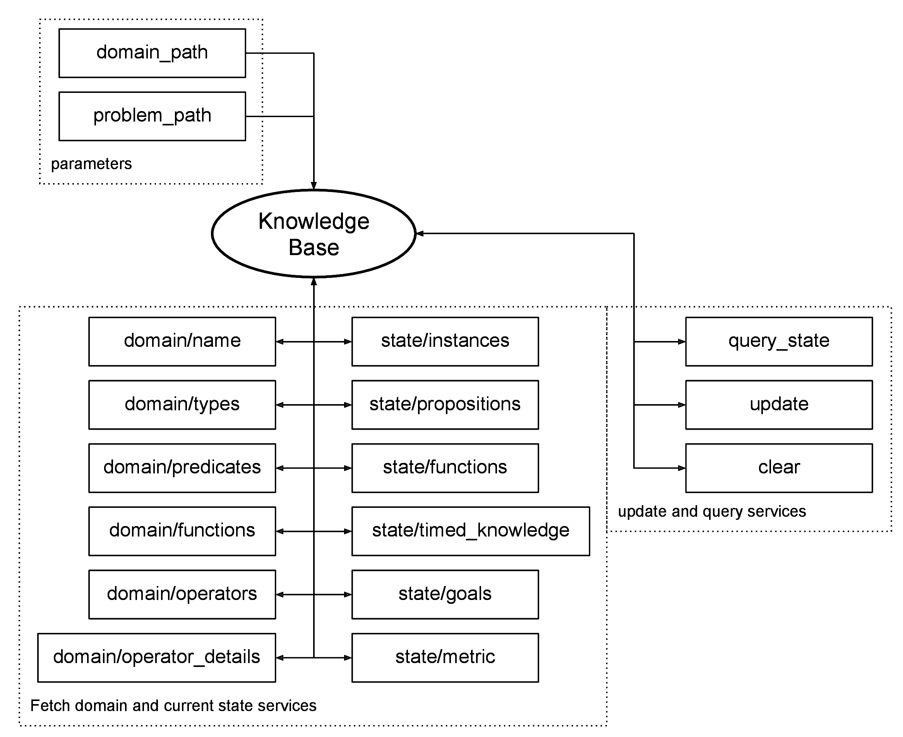

{: .big_chart }

The Knowledge Base can be launched by adding the following parameters and nodes to your launch file:

```xml
<launch>

	<!-- arguments -->
	<arg name="domain_path"	default="$(find rosplan_demos)/common/domain_turtlebot.pddl" />
	<arg name="problem_path"	default="$(find rosplan_demos)/common/problem_turtlebot.pddl" />

	<!-- knowledge base -->
	<node name="rosplan_knowledge_base" pkg="rosplan_knowledge_base" type="knowledgeBase" respawn="false" output="screen">
		<param name="domain_path" value="$(arg domain_path)" />
		<param name="problem_path" value="$(arg problem_path)" />
		<param name="database_path" value="$(find rosplan_knowledge_base)/common/mongoDB/" />
		<!-- conditional planning flags -->
		<param name="use_unknowns" value="false" />
	</node>

	<!-- scene database (MongoDB) -->
	<include file="$(find mongodb_store)/launch/mongodb_store.launch">
		<arg name="db_path" value="$(find rosplan_knowledge_base)/common/mongoDB/"/>
	</include>

</launch>
```

- The **rosplan_knowledge_base** node stores the PDDL model. It can be queried for information on the PDDL domain model, and problem instance. It should be updated by state estimation.
- The **scene_database** node is a ROS interface to a MongoDB, maintained by the University of Birmingham, [mongodb_store on ROS wiki.](http://wiki.ros.org/mongodb_store)

## Parameters

| Parameter     | Optional? | Description |
| domain_path   |           | Path to the PDDL domain file. |
| problem_path  | Yes       | Path to the PDDL problem file specifying the initial state. |
| database_path |           | Path to files generated by MongoDB. |
| use_unknowns  |           | If true, facts not explicitly entered as false in the knowledge base are assumed to be unknown. This is used for planning under uncertainty. |
